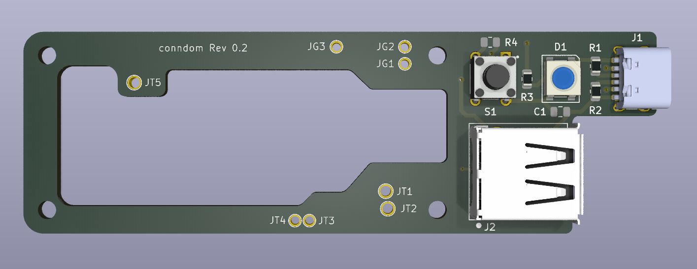
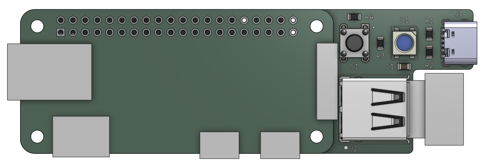
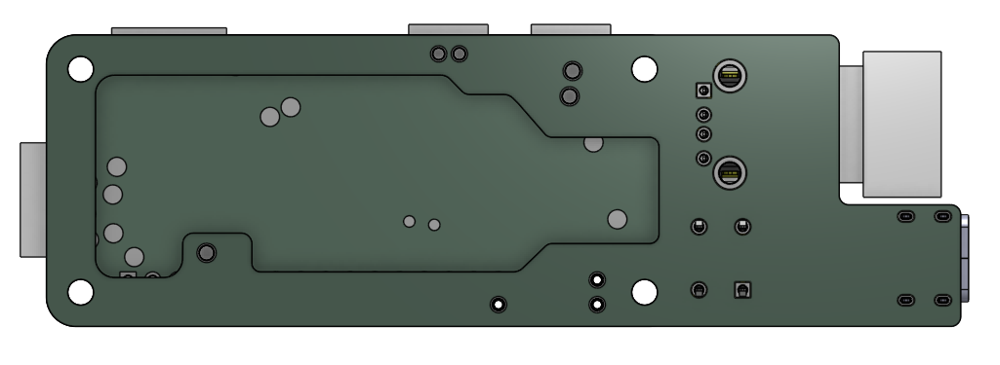

# conndom
*WiP*

### PCB

#### BOM

| Designator | Quantity | Designation | Mfr.     | Mfr. No.                | Comment |
|------------|----------|-------------|----------|-------------------------|---------|
| R1,R2      | 2        | 5.1 kohm    | -        | -                       | 0805    |
| J2         | 1        | USB A WIFI  | Same Sky | UJ2-AH-4-TH             |         |
| J1         | 1        | USB C PWR   | Same Sky | UJC-HP2-3-SMT-TR        |         |
| S1         | 1        | PWR BTN     | Same Sky | TS02-66-55-BK-260-LCR-D |         |
| R3         | 1        | 500 ohm     | -        | -                       | 0805    |
| D1         | 1        | SK6812      | Adafruit | 1655                    | 10 Pack |

### PCB Assembly

### PCB Assembly Bottom

